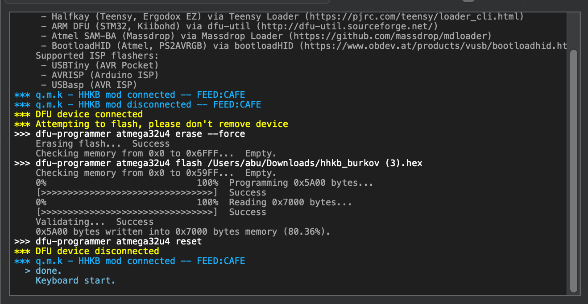
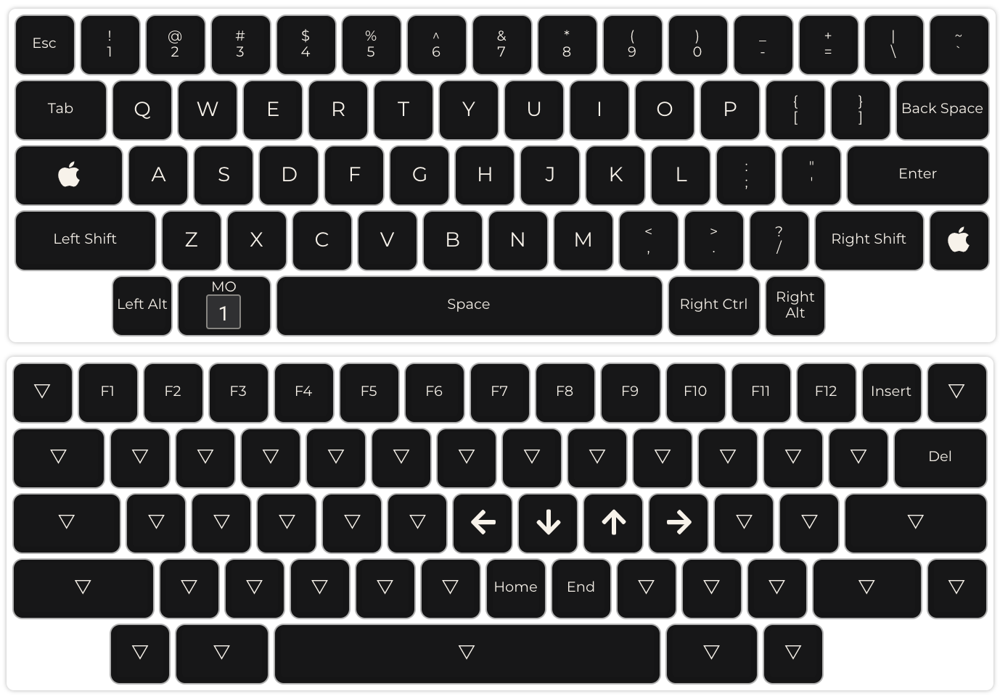

# About
This is my QMK configuration for HHKB2 keyboard. I use Hasu alternative programmable controller.

# How to re-configure
1. Upload json file to the [QMK configurator](https://config.qmk.fm/#/hhkb/LAYOUT) 
2. Change the layout whatever you like
3. Compile and download firmware in HEX format.
4. Open downloaded firmware in the QMK toolbox. Atmega32u4 microcontroller should be selected.
5. Enter programming mode on the keyboard by pressing the only button on the controller (you will see `DFU device connected` in the log)
6. Press Flash. 
7. Controller will exit programming mode automatically after the end of the flashing procedure.

# Linux layout
No lefthand side Meta:

# Mac layout
No lefthand side Ctrl:

